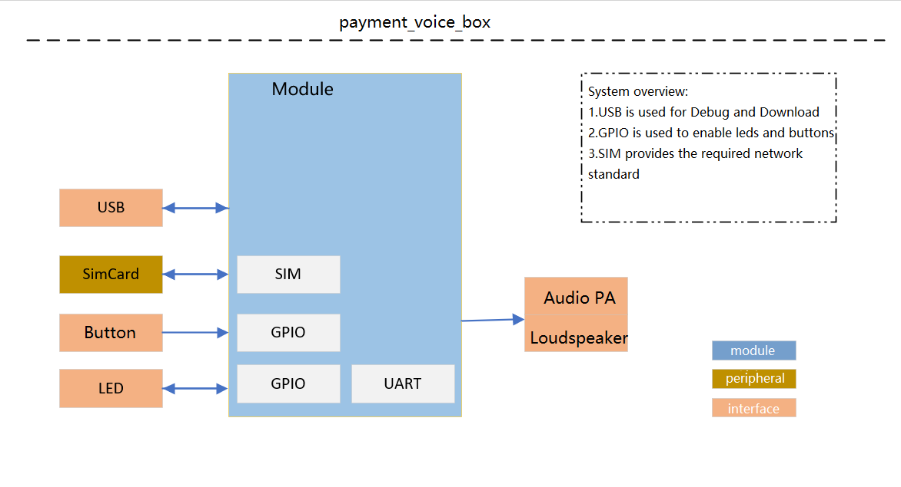
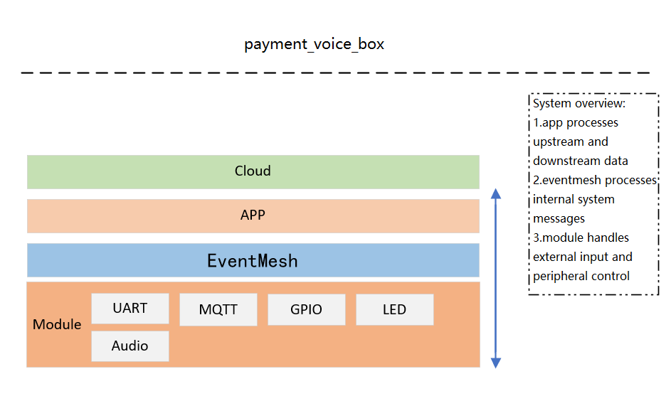
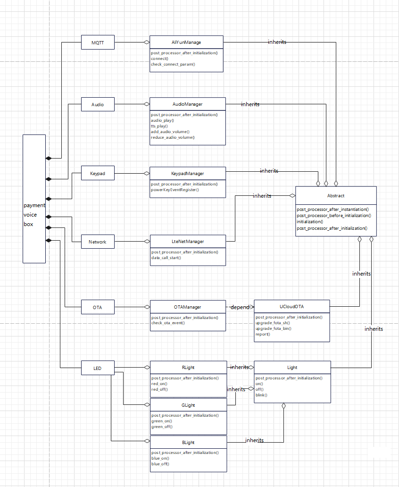
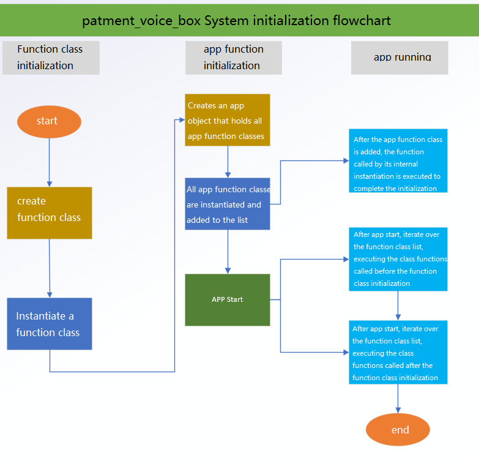

# QuecPython Cloud Speaker Software Usage Guide

## overview

The QuecPython cloud speaker solution is developed using the EventMesh framework. This document mainly describes the design framework of the cloud speaker software, including the function descriptions of core components, the introduction of the system initialization process, and more, to facilitate a quicker understanding of this framework. It also introduces how to fully run the cloud speaker software framework using QuecPython, including how to configure relevant configuration items and how to perform secondary development based on this demo.

## System Framework

### Hardware System Framework

The hardware system framework is as follows:

The Module side supports SIM, GPIO, UART, AUDIO, and other functions.



### Software System Framework

The software system framework is as follows:

1. The APP layer implements the core business processing of the cloud speaker, parsing upstream and downstream data (transaction data, OTA, other business data, etc.).
2. EventMesh acts as an event processor, completing functional flow through the mechanism of supporting event subscription and publishing.
3. The Module side processes and executes external events or data received through EventMesh.



### Functional Components
Component object relationship description:

The diagram below depicts the dependency and inheritance relationships between various component objects in the project software code. Each component object forms the business components of the cloud speaker.

The diagram shows the cloud speaker as the main object, linking the functional objects it relies on, detailing the core object's methods, and the functional classes it depends on, as shown below:



## System Components

### EventMesh

Services and drivers communicate data through EventMesh. All events come from EventStore. Service providers register interfaces and topics in EventMesh, and service callers call corresponding interfaces from EventMesh through topics. This behavior of subscribing and publishing events (topics) replaces direct function calls, with message flows between different businesses completed through EventMesh.

Subscribe to events:

```python
from usr import EventMesh

def test(event, msg):
	return msg

# Subscribe to events
EventMesh.subscribe("test_event", test)
```

Publish events：

```python
# Publish events
EventMesh.publish("test_event", "TEST_OK")
```


### AudioManager

- Function Description
Controls the device's audio output, including TTS voice broadcast, audio file playback, audio volume setting, etc.

- Implementation Principle

1. The class initialization method completes the initialization of audio functions, simplifying the original volume levels into five levels for ease of use.


```python
class AudioManager(Abstract):
    """
    Audio file playback
    TTS Broadcast Management (Splicing)
    """

    def __init__(self):
        self.__audio = audio.Audio(0)
        self.__audio_volume = 3
        self.__tts_priority = 3
        self.__tts_break_in = 0
        self.__audio_mode = ""
        self.__speak_en_pin = None
        self.__volume_level = {
            1: 1,
            2: 3,
            3: 6,
            4: 9,
            5: 11
        }
```

2.After initializing the class method, the methods exposed to the outside are registered to EventMesh to complete the volume initialization settings.

```python
	def post_processor_after_initialization(self):
        self.__set_audio_pa() # set pa
        self.__audio_volume = publish("persistent_config_get", "volume")
        self.__audio_mode = publish("persistent_config_get", "audio_mode")
        if not self.__audio_volume:
            self.__audio_volume = 5
        # set TTS volume
        self.__audio.setVolume(self.__volume_level.get(self.__audio_volume))
		# Interface registration for exposing functions to the outside world
        subscribe("audio_file_play", self.audio_file_play)
        subscribe("number_play", self.number_play)
        subscribe("audio_bat_play", self.audio_bat_play)
        subscribe("audio_play_stop", self.audio_play_stop)
        subscribe("get_audio_state", self.get_audio_state)
        subscribe("add_audio_volume", self.add_audio_volume)
        subscribe("reduce_audio_volume", self.reduce_audio_volume)
```

3. Audio Interface for playing audio files & TTS interface for playing input content. It is directly used through the audio API provided by QuecPython. For details about how to use the API, see the wiki documentation.

```python
	def audio_play(self, topic=None, filename=None):
        """Play audio"""
        if filename is None:
            return
        # Set priority and interrupt mode
        state = self.__audio.play(self.__tts_priority, self.__tts_break_in, filename)
        return True if state == 0 else False

    def number_play(self, topic=None, content=None):
        """Play tts number"""
        if content is None:
            return
        self.__audio_lib_play(content, self.__MERGE_MP3_FILE, self.amount_data)
```


### ConfigStoreManager

The configuration file management module is mainly used to deal with the persistent storage of device parameters, provide the method of parameter reading and parameter updating, and interact with the module file system through this method

- Function Description

Configuration files generally read and write two interfaces, in all parts of the service have read and write requirements, so in order to enable the service module to call the two interfaces, before the service module initialization need to initialize the configuration file management module

- Implementation principle

1. If the configuration file does not exist, a JSON file is created. After the file is created, default parameters are written into the file.
2. If the file already exists, the system compares whether default parameters are added. If new parameters are added, update them to the configuration file
3. This method reads and writes two events through EventMesh registration

```python
def post_processor_after_initialization(self):
        if ql_fs.path_exists(self.file_name):  # Check whether the file exists
            file_map = ql_fs.read_json(self.file_name)
            # Compare whether parameters are added. 
            # If any parameters are added, synchronize them to the file
            for k in self.map.keys():
                if k not in file_map:
                    file_map.update({k: self.map.get(k)})
            self.__store(msg=file_map)
            self.map = file_map
        else:
            self.__store()
        subscribe("persistent_config_get", self.__read)
        subscribe("persistent_config_store", self.__store)
```

### HistoryOrderManager

History order management module for writing and reading history order messages

- Function Description

Write order information when there is a transaction, and query order information when there is a historical order play request

- Implementation principle

1. The configuration file generally reads and writes two interfaces. Each part of the service requires reading and writing. Therefore, the service module must be able to call the two interfaces.
2. Check whether there is a history order configuration file. If yes, add to it. If no, create and write the order data
3. This method registers read, write, and exit events through EventMesh

```python
class HistoryOrderManager(Abstract):
    def __init__(self, max_hist_num=10):
        self.file_name = "/usr/history_order.json"
        self.map = dict(order=[])
        self.Cnt = 0
        self.lock = Lock()
        self.__max_hist_num = max_hist_num

    def post_processor_after_initialization(self):
        if ql_fs.path_exists(self.file_name):
            file_map = ql_fs.read_json(self.file_name)
            self.map = file_map
        else:
            ql_fs.touch(self.file_name, self.map)
        subscribe("Order_history_read", self.__read)
        subscribe("Order_history_write", self.__write)
        subscribe("Order_history_exit", self.__exit)
```


### LteNetManager

- Function Description

This function is mainly used for module network initialization and network status management. The device uses automatic dialing by default. If you need to adjust it to manual dialing or use the Settings

For details about how to modify APN dial-up, refer to the API manual

- Implementation principle

1. When initializing the method, the device waits for the completion of network annotation, registers the network change callback function, and determines the device's network finding status by using the checkNet API return value. After the network finding is successful, the TCP connection is started by means of event announcement.

  ```python
  	def wait_connect(self, timeout):
          """Wait for the device to find the network"""
          self.log.info("wait net -----------")
          stagecode, subcode = self.check_net.wait_network_connected(timeout)
          if stagecode == 3 and subcode == 1:
              # Net injection success
              publish("audio_file_play", "DEVICE_NET_OK")
              publish("set_4g_wifi", 0)
              self.log.info("module net success, run mqtt connect")
              if publish('mqtt_connect'):
                  publish("audio_file_play", "DEVICE_SERVER_OK")
              else:
                  publish("audio_file_play", "DEVICE_SERVER_FAILED")
              self.net_error_audio_stop()
        	else:
              # Net injection failure
              self.__net_error_mode = 1
              self.log.error("module net fail, wait try again")
              self.net_error_audio_start()
              publish("audio_file_play", "DEVICE_NET_FAILED")
              self.net_fail_process()
          self.__data_call.setCallback(self.net_state_cb)  # Register a network callback
  ```

2. When the network status changes, we can register a callback to notify the application layer, as shown in the following figure

  ```python
  	def net_state_cb(self, args):
          """The callback function is triggered when the network status changes"""
          nw_sta = args[1]
          if nw_sta == 1:
              publish("audio_file_play", "DEVICE_NET_OK")
              self.log.info("network connected!")
              self.net_error_audio_stop()
          else:
              self.net_error_audio_start()
              publish("audio_file_play", "DEVICE_NET_FAILED")
              self.log.info("network not connected!")
  ```

3. Example of abnormal network reconnection:
If the network is abnormal, it will try to use Cfun switch to find the network again. If cfun fails, it can consider restarting the module. If the number of times needs to be limited, it will be controlled by recording a value in the configuration file.

  ```python
  	def net_fail_process(self):
          # If Cfun fails, try to find the network again. If Cfun fails, the module restarts
          state = net.setModemFun(0)
          if state == -1:
              self.log.error("cfun net mode error, device will restart.")
              utime.sleep(5)
              # Power.powerRestart()
          state = net.setModemFun(1)
          if state == -1:
              self.log.error("cfun net mode error, device will restart.")
              utime.sleep(5)
              # Power.powerRestart()
          self.log.info("cfun net mode success, note the net again")
          self.wait_connect(30)
  ```


### DeviceInfoManager

- Function Description

This function is used to obtain some basic information of the device, such as the IMEI of the device, ICCID of the SIM card, firmware, software version number, signal value, and so on.

- Implementation principle

During class function initialization, the function that obtains device information is registered as an event and can be used by event publishing.

```python
def post_processor_after_instantiation(self):
        # Register event
        subscribe("get_sim_iccid", self.get_iccid)
        subscribe("get_device_imei", self.get_imei)
        subscribe("get_fw_version", self.get_device_fw_version)
        subscribe("get_csq", self.get_csq)
        subscribe("get_sn", self.get_sn)
```

### OtaManager

- Function Description

This function is used to update the APP application code through remote upgrade. Currently, the interface provides the file download and decompression upgrade process. OTA upgrade only needs to be done through EventMesh or directly by invoking the interface

- Implementation principle

The upgrade method is invoked through event publishing. The upgrade task can be delivered through the cloud platform or triggered by TCP active version query. After the download is complete, the device restarts to complete the upgrade

After the OTA file is successfully downloaded, decompress it to the fota partition, restart the device, and upgrade successfully.

```python
		if download_result == 0:
            app_fota_download.app_fota_pkg_mount.mount_disk()
            fd = FileDecode(tar_src, parent_dir=app_fota_download.get_updater_dir())
            fd.unzip()
            stat = fd.unpack()
            if stat:
                uos.remove(tar_src)
                fd.update_stat()
                fd.set_flag()
                # Power...RESTART
                print("Decompress the package success")
            else:
                print("Decompress the package failed")
                download_result = 1
```


### CloudManage

- Function Description

The module function is used to connect the device to the IOT platform through the MQTT protocol (taking Alibaba Cloud as an example), providing connection, disconnection, data uplink and downlink and other functions.

- Implementation principle

1. Creating a class method will initialize the class attributes in the class initialization method, including triples connected to the cloud platform, and the retention time

  ```python
  class CloudManager(Abstract):
      """
      MQTT interface
      """
  
      def __init__(self):
          self.__server = " "   # mqtt broker IP
          self.__port = 1883
          self.__mqtt_client = None
          self.product_key = ''  # product key
          self.product_secret = None  # product secret
          self.device_name = ''  # device name (SN)
          self.device_secret = ''  # device secret
          self.client_id = ''  # client_id (SN)
          self.password = ""  # passwd
          self.clean_session = True  # Client type (False: persistent client, True: temporary)
          self.keep_alive = 300  # Maximum communication time allowed (s)
          self.sub_topic = ''  # Subscription address
          self.qos = 1  # Message Quality of Service 0: The sender sends the message only once and does not retry 1: The sender sends the message at least once to ensure that the message reaches the Broker
          self.conn_flag = False
          self.start_mqtt_flag = False
  ```

2. After initializing class methods, the exposed methods are registered to the EventMesh through events
  ```python
  def post_processor_after_initialization(self):
          subscribe("mqtt_connect", self.__start_mqtt_connect)
  ```

3. Initiate a connection request

  ```python
  def __connect(self, topic=None, data=None):
          if not self.__check_connect_param():
              return False
          if not self.conn_flag:
              self.conn_flag = True
          self.__mqtt_client = MQTTClient(self.client_id, self.__server, port=self.__port, user=self.device_name,password=self.password, keepalive=120, ssl=False, ssl_params={}, reconn=True)
          try:
              con_state = self.__mqtt_client.connect()
          except ValueError as e:
              con_state = 1
              self.log.info("connect  error --{}".format(e))
  ```

4. Downlink data callback function


  ```python
  def callback(self, topic, msg):
          """mqtt msg callback"""
          return self.__customer_sub(topic, msg)
          # After receiving the cloud platform message, the message is sent to the queue for execution
  ```


### DeviceActionManager

- Function Description

This module is used for device status control, which can control the device on/off, restart, standby state, and peripheral control.

- Implementation principle

1. After class methods are initialized, the exposed methods are registered with EventMesh through events.

  ```python
   def post_processor_after_initialization(self):
          # Register event
          subscribe("device_start", self.device_start)
          subscribe("device_shutdown", self.device_shutdown)
          subscribe("device_restart", self.device_restart)
  ```

2. External service invocation invokes the corresponding function interface through the corresponding event topic
	```python
   def device_shutdown(self, topic=None, data=None):
        # device shutdown
        # publish("audio_play", AUDIO_FILE_NAME.DEVICE_SHUTDOWN)
        pass
        utime.sleep(5)
        Power.powerDown()

    def device_start(self, topic=None, data=None):
        # device start
        # publish("audio_play", AUDIO_FILE_NAME.DEVICE_START)
        pass

    def device_restart(self, topic=None, data=None):
        # device restart
        Power.powerRestart()
  ```
  

### RGBLight

- Function Description

The module is used to manage the Led light status of the device, and control the switching and blinking action of the Led by enabling GPIO.

- Implementation principle

1. Creating a class method will complete the initialization of the class properties and the initialization of the led light GPIO pin in __init__.
```python
def post_processor_after_initialization(self):
	subscribe("light_enable", self.light_enable)
	subscribe("light_switch", self.switch)
	subscribe("light_blink", self.blink)
	subscribe("blink_close", self.close)
```
2. After class methods are initialized, the exposed methods are registered with EventMesh through events

### LcdManager

- Function Description

This module is used for device screen display content refresh, display status management, control LCD backlight and analog SPI communication driver screen through GPIO enable.

- Implementation principle

1. Create a class method in __init__ to complete the initialization of the class properties and the definition of the screen cache, including the timer of the refresh time and the subscript of the screen cache corresponding to the display area

2. After class methods are initialized, the exposed methods are registered with EventMesh through events

```python
def post_processor_after_initialization(self):
   subscribe("set_battery_signal", self._set_battery_signal)
   subscribe("set_4g_wifi", self._set_4g_wifi)
   subscribe("set_money", self._set_money)
   subscribe("set_time", self._set_time)
   subscribe("set_count", self._set_count)
```
3. The external interface includes setting the battery, signal, amount, number of transactions, and time
4. Screen refresh principle Using three-way GPIO to simulate three-line SPI communication driver screen

```python
def _write(flag, data):
    LcdManager.CS.write(0)
    LcdManager.SDA.write(1) if flag else LcdManager.SDA.write(0)
    LcdManager.SCK.write(0)
    LcdManager.SCK.write(1)
    for i in range(8):
        LcdManager.SDA.write(1) if data & 0x80 else LcdManager.SDA.write(0)
        LcdManager.SCK.write(0)
        LcdManager.SCK.write(1)
        data <<= 1
    LcdManager.CS.write(1)
```

### MenuManager

- Function Description

Menu management: This module is used to manage the mapping relationship of key functions and map the corresponding trigger mode of the corresponding key to the corresponding function

- Implementation principle

1. Initialize the button API to register the click, double-click and long press events, and output the events to the menu management module through the queue and message publishing mechanism

2. menu registers two external interfaces: key event and menu event. Key event is the function corresponding to a key, and menu event is the event generated by switching the menu

3. You can switch menu functions and customize menu configurations by defining menu configuration tables

```python
"BaseMenu":
        {
            "action":
                {
                    "enter": None,
                    "quit": None,
                },
            "event":
                {
                    "KEY_VOLUM_DOWN_SHORT": ["reduce_audio_volume", None],
                    "KEY_VOLUM_UP_SHORT": ["add_audio_volume", None],
                    "KEY_POWER_SHORT": ["bat_value_play", None],
                    "KEY_FUNC_SHORT": ["menu_enter", "OrderMenu"],
                }
        },
```

## System Initialization Process
Explanation of the system initialization process:

1. Initialize all functional classes of the cloud speaker.
2. All class methods must agree to complete event registration or functional processing before and after initialization or instantiation. Therefore, we use an APP class to execute the actions before and after the initialization of each class method during loading and start.


## Business Process
The main business process of the cloud speaker involves the interaction between the module and the cloud, such as the cloud issuing play instructions, issuing upgrade commands, etc.


## Running Tutorial
Refer to the readme for the code running tutorial.

### Simulated Payment Process
1. Create a product on the Alibaba Cloud IoT platform, and create a device under the product directory. The device name (DeviceName) is the SN number of the debugging development board.
2. Modify the code/conf_store.json to include the product_key and product_secret of the device created in the previous step.
3. Download the modified code/conf_store.json to the module and run the _main.py script.
4. Use mqtt.fx to publish content to the topic {ProductKey}/{DeviceName}/user/task with the message {"broadcast_type":2,"money":"0.01","biz_type":2,"request_id":"99711180000202012162212481044206"}, where money is the amount to be broadcasted.
