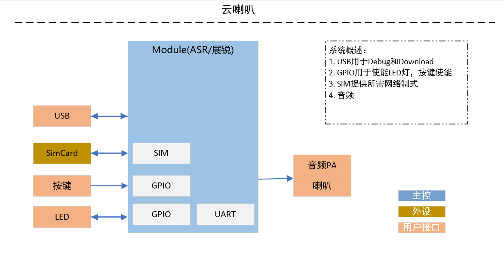

# QuecPython 云喇叭软件使用指导

## 概述

QuecPython云喇叭方案使用EventMesh框架开发，此文档主要描述云喇叭软件设计框架,包含核心组件功能描述，系统初始化流程的介绍等，方便更快理解本框架，并且介绍使用QuecPython完整运行云喇叭软件框架，包括相应配置项该如何配置以及如何基于该demo进行二次开发等

## 系统框架

### 硬件系统框架

硬件系统框架如下：

Module侧支持SIM，GPIO，UART，AUDIO等功能



### 软件系统框架

软件系统框架如下:

1. APP层实现处理云喇叭核心业务，解析上下行数据（交易数据、OTA、其他业务数据等）
2. EventMesh为事件处理器，通过支持事件订阅发布的机制来完成功能流转
3. Module侧接收外部事件或数据通过EventMesh驱动来处理执行


### 功能组件

组件对象关系描述:

下图用于描绘项目软件代码中各组件对象之间的依赖关系与继承关系，各个组件对象为云喇叭的业务组件构成

图中以云喇叭作为总对象，将云喇叭所依赖的功能对象联系到一起，核心的对象拥有哪些方法，依赖哪些功能类，具体如下图所示：


## 系统组件

### EventMesh

服务和驱动通过EventMesh进行数据通信, 所有的Event都是从EventStore里面过来的, 服务提供方将接口和topic注册到EventMesh中，服务调用方通过topic从EventMesh中调用对应的接口，通过以上订阅和发布事件（topic）的行为来代替直接调用函数，不同业务之间的消息流转都通过EventMesh来完成

订阅事件：

```python
from usr import EventMesh

def test(event, msg):
	return msg

# 订阅事件
EventMesh.subscribe("test_event", test)
```

发布事件：

```python
# 发布事件
EventMesh.publish("test_event", "TEST_OK")
```


### AudioManager

- 功能描述

控制设备音频输出，包含TTS语音播报，音频文件播放，音频音量设置等功能。

- 实现原理

1.创建类方法会在该类初始化方法内完成audio功能的初始化，将原始音量等级简化成5个等级，方便使用。

```python
class AudioManager(Abstract):
    """
    Audio file playback
    TTS Broadcast Management (Splicing)
    """

    def __init__(self):
        self.__audio = audio.Audio(0)
        self.__audio_volume = 3
        self.__tts_priority = 3
        self.__tts_break_in = 0
        self.__audio_mode = ""
        self.__speak_en_pin = None
        self.__volume_level = {
            1: 1,
            2: 3,
            3: 6,
            4: 9,
            5: 11
        }
```

2.初始化类方法后将对外暴露的方法通过事件注册到EventMesh中，完成音量初始化设置。

```python
	def post_processor_after_initialization(self):
        self.__set_audio_pa() # set pa
        self.__audio_volume = publish("persistent_config_get", "volume")
        self.__audio_mode = publish("persistent_config_get", "audio_mode")
        if not self.__audio_volume:
            self.__audio_volume = 5
        # set TTS volume
        self.__audio.setVolume(self.__volume_level.get(self.__audio_volume))
		# Interface registration for exposing functions to the outside world
        subscribe("audio_file_play", self.audio_file_play)
        subscribe("number_play", self.number_play)
        subscribe("audio_bat_play", self.audio_bat_play)
        subscribe("audio_play_stop", self.audio_play_stop)
        subscribe("get_audio_state", self.get_audio_state)
        subscribe("add_audio_volume", self.add_audio_volume)
        subscribe("reduce_audio_volume", self.reduce_audio_volume)
```

3.Audio播放音频文件接口 & TTS播放输入内容接口，通过QuecPython提供的audio API直接使用，API详细使用描述参考wiki文档。

```python
	def audio_play(self, topic=None, filename=None):
        """Play audio"""
        if filename is None:
            return
        # Set priority and interrupt mode
        state = self.__audio.play(self.__tts_priority, self.__tts_break_in, filename)
        return True if state == 0 else False

    def number_play(self, topic=None, content=None):
        """Play tts number"""
        if content is None:
            return
        self.__audio_lib_play(content, self.__MERGE_MP3_FILE, self.amount_data)
```


### ConfigStoreManager

配置文件管理模块主要用于处理设备参数持久化保存，提供参数读取于参数更新的方法，通过该方法与模组文件系统交互

- 功能描述

配置文件一般读、写两个接口,在业务的各个部分中都有读取和写入的需求,所以为了让业务模块可以调用到这两个接口，在业务模块初始化之前就需要初始化配置文件管理模块 

- 实现原理

1.  初始化类方法时会判断配置文件是否存在，不存在则创建一个JSON文件，文件创建成功后将默认参数写入文件中。
2.  若文件已存在，则会比对默认参数有无新增，若有新增同步更新到配置文件
3.  该类方法对外通过EventMesh注册读取和写入两个事件

```python
def post_processor_after_initialization(self):
        if ql_fs.path_exists(self.file_name):  # Check whether the file exists
            file_map = ql_fs.read_json(self.file_name)
            # Compare whether parameters are added. 
            # If any parameters are added, synchronize them to the file
            for k in self.map.keys():
                if k not in file_map:
                    file_map.update({k: self.map.get(k)})
            self.__store(msg=file_map)
            self.map = file_map
        else:
            self.__store()
        subscribe("persistent_config_get", self.__read)
        subscribe("persistent_config_store", self.__store)
```

### HistoryOrderManager

历史订单管理模块，用于历史订单消息的写入和读取

- 功能描述

当有交易发生时写入订单信息，当有历史订单播放请求时查询订单信息

- 实现原理

1.  配置文件一般读写两个接口,在业务的各个部分中都有读取和写入的需求,所以需要让业务模块可以调用到这两个接口。
2.  检测是否已经有历史订单配置文件，有则追加写入，无则创建后再写入订单数据
3.  该类方法对外通过EventMesh注册读取和写入以及退出事件
```python
class HistoryOrderManager(Abstract):
    def __init__(self, max_hist_num=10):
        self.file_name = "/usr/history_order.json"
        self.map = dict(order=[])
        self.Cnt = 0
        self.lock = Lock()
        self.__max_hist_num = max_hist_num

    def post_processor_after_initialization(self):
        if ql_fs.path_exists(self.file_name):
            file_map = ql_fs.read_json(self.file_name)
            self.map = file_map
        else:
            ql_fs.touch(self.file_name, self.map)
        subscribe("Order_history_read", self.__read)
        subscribe("Order_history_write", self.__write)
        subscribe("Order_history_exit", self.__exit)
```


### LteNetManager

- 功能描述

该功能主要用于模组网络初始化以及网络状态管理，设备默认为自动拨号注网，如需调整为手动拨号或者需要使用设置的

APN进行拨号请参考API手册进行修改，下面做简要描述

- 实现原理

1. 该类方法初始化时会等待设备注网完成，且注册网络变化回调函数，通过checkNet API返回值判断设备找网状态，找网成功后会通过事件发布的方式启动TCP连接，若找网失败则会尝试重新找网。

  ```python
  	def wait_connect(self, timeout):
          """Wait for the device to find the network"""
          self.log.info("wait net -----------")
          stagecode, subcode = self.check_net.wait_network_connected(timeout)
          if stagecode == 3 and subcode == 1:
              # Net injection success
              publish("audio_file_play", "DEVICE_NET_OK")
              publish("set_4g_wifi", 0)
              self.log.info("module net success, run mqtt connect")
              if publish('mqtt_connect'):
                  publish("audio_file_play", "DEVICE_SERVER_OK")
              else:
                  publish("audio_file_play", "DEVICE_SERVER_FAILED")
              self.net_error_audio_stop()
        	else:
              # Net injection failure
              self.__net_error_mode = 1
              self.log.error("module net fail, wait try again")
              self.net_error_audio_start()
              publish("audio_file_play", "DEVICE_NET_FAILED")
              self.net_fail_process()
          self.__data_call.setCallback(self.net_state_cb)  # Register a network callback
  ```

2. 网络状态异常处理，当设备网络状态发生变化时我们可以通过注册回调的方式来通知到应用层，如下所示

  ```python
  	def net_state_cb(self, args):
          """The callback function is triggered when the network status changes"""
          nw_sta = args[1]
          if nw_sta == 1:
              publish("audio_file_play", "DEVICE_NET_OK")
              self.log.info("network connected!")
              self.net_error_audio_stop()
          else:
              self.net_error_audio_start()
              publish("audio_file_play", "DEVICE_NET_FAILED")
              self.log.info("network not connected!")
  ```

3. 网络状态出现异常重连的示例：
  网络异常后会先尝试使用Cfun切换来重新找网，若cfun失败可考虑重启模组，若需要做次数限制则通过配置文件记录一个值来控制。

  ```python
  	def net_fail_process(self):
          # If Cfun fails, try to find the network again. If Cfun fails, the module restarts
          state = net.setModemFun(0)
          if state == -1:
              self.log.error("cfun net mode error, device will restart.")
              utime.sleep(5)
              # Power.powerRestart()
          state = net.setModemFun(1)
          if state == -1:
              self.log.error("cfun net mode error, device will restart.")
              utime.sleep(5)
              # Power.powerRestart()
          self.log.info("cfun net mode success, note the net again")
          self.wait_connect(30)
  ```


### DeviceInfoManager

- 功能描述

该功能用于获取设备的一些基础信息，例如设备IMEI，SIM card的ICCID，固件、软件的版本号，信号值等。

- 实现原理

类函数初始化时会将获取设备信息的函数注册成事件对外提供，可直接通过事件发布的方式使用。

```python
def post_processor_after_instantiation(self):
        # Register event
        subscribe("get_sim_iccid", self.get_iccid)
        subscribe("get_device_imei", self.get_imei)
        subscribe("get_fw_version", self.get_device_fw_version)
        subscribe("get_csq", self.get_csq)
        subscribe("get_sn", self.get_sn)
```

### OtaManager

- 功能描述

该功能用于对APP应用程序代码通过远程升级更新，目前接口提供文件下载解压升级流程，OTA升级只需通过EventMesh或者直接调用接口即可

- 实现原理

通过事件发布的方式调用升级方法，触发升级任务可以通过云平台下发或者TCP主动查询版本触发，下载完成后设备会重启完成升级

OTA文件下载成功后，解压到fota分区，重启设备后升级成功。

```python
		if download_result == 0:
            app_fota_download.app_fota_pkg_mount.mount_disk()
            fd = FileDecode(tar_src, parent_dir=app_fota_download.get_updater_dir())
            fd.unzip()
            stat = fd.unpack()
            if stat:
                uos.remove(tar_src)
                fd.update_stat()
                fd.set_flag()
                # Power...RESTART
                print("Decompress the package success")
            else:
                print("Decompress the package failed")
                download_result = 1
```


### CloudManage

- 功能描述

该模块功能用于将设备通过MQTT协议连接到IOT平台（以阿里云为例），提供连接，断开连接，数据上下行等功能。

- 实现原理

1. 创建类方法会在类初始化方法内完成类属性的初始化，类属性包含连接云平台的三元组，保活时间等

  ```python
  class CloudManager(Abstract):
      """
      MQTT interface
      """
  
      def __init__(self):
          self.__server = " "   # mqtt broker IP
          self.__port = 1883
          self.__mqtt_client = None
          self.product_key = ''  # product key
          self.product_secret = None  # product secret
          self.device_name = ''  # device name (SN)
          self.device_secret = ''  # device secret
          self.client_id = ''  # client_id (SN)
          self.password = ""  # passwd
          self.clean_session = True  # Client type (False: persistent client, True: temporary)
          self.keep_alive = 300  # Maximum communication time allowed (s)
          self.sub_topic = ''  # Subscription address
          self.qos = 1  # Message Quality of Service 0: The sender sends the message only once and does not retry 1: The sender sends the message at least once to ensure that the message reaches the Broker
          self.conn_flag = False
          self.start_mqtt_flag = False
  ```

2. 初始化类方法后将对外暴露的方法通过事件注册到EventMesh中

  ```python
  def post_processor_after_initialization(self):
          subscribe("mqtt_connect", self.__start_mqtt_connect)
  ```

3. 发起连接请求

  ```python
  def __connect(self, topic=None, data=None):
          if not self.__check_connect_param():
              return False
          if not self.conn_flag:
              self.conn_flag = True
          self.__mqtt_client = MQTTClient(self.client_id, self.__server, port=self.__port, user=self.device_name,password=self.password, keepalive=120, ssl=False, ssl_params={}, reconn=True)
          try:
              con_state = self.__mqtt_client.connect()
          except ValueError as e:
              con_state = 1
              self.log.info("connect  error --{}".format(e))
  ```

4. 下行数据回调函数


  ```python
  def callback(self, topic, msg):
          """mqtt msg callback"""
          return self.__customer_sub(topic, msg)
          # After receiving the cloud platform message, the message is sent to the queue for execution
  ```


### DeviceActionManager

- 功能描述

此模块用于设备状态控制，可以控制设备开关机，重启，待机状态，以及外设控制等。

- 实现原理

1. 初始化类方法后将对外暴露的方法通过事件注册到EventMesh中。

  ```python
   def post_processor_after_initialization(self):
          # Register event
          subscribe("device_start", self.device_start)
          subscribe("device_shutdown", self.device_shutdown)
          subscribe("device_restart", self.device_restart)
  ```

2. 外部业务调用通过对应的事件主题来调用对应的功能接口
	```python
	def device_shutdown(self, topic=None, data=None):
		# device shutdown
		# publish("audio_play", AUDIO_FILE_NAME.DEVICE_SHUTDOWN)
		pass
		utime.sleep(5)
		Power.powerDown()
	
	    def device_start(self, topic=None, data=None):
		# device start
		# publish("audio_play", AUDIO_FILE_NAME.DEVICE_START)
		pass
	
	    def device_restart(self, topic=None, data=None):
		# device restart
		Power.powerRestart()
	```

### RGBLight

- 功能描述

该模块用于设备Led灯状态管理，通过GPIO使能控制Led的开关和闪烁动作。

- 实现原理

1. 创建类方法会在__init__内完成类属性的初始化和led灯GPIO管脚的初始化。
```python
def post_processor_after_initialization(self):
	"""订阅此类所有的事件到 EventMesh中"""
	subscribe("light_enable", self.light_enable)
	subscribe("light_switch", self.switch)
	subscribe("light_blink", self.blink)
	subscribe("blink_close", self.close)
```
2. 初始化类方法后将对外暴露的方法通过事件注册到EventMesh中

### LcdManager

- 功能描述

该模块用于设备屏幕显示内容刷新、显示状态管理，通过GPIO使能控制LCD的背光和模拟SPI通讯驱动屏幕。

- 实现原理

1. 创建类方法会在__init__内完成类属性的初始化和屏幕显示缓存的定义，包括刷新时间的定时器、屏幕显示缓存对应显示区域的下标

2. 初始化类方法后将对外暴露的方法通过事件注册到EventMesh中

```python
def post_processor_after_initialization(self):
   subscribe("set_battery_signal", self._set_battery_signal)
   subscribe("set_4g_wifi", self._set_4g_wifi)
   subscribe("set_money", self._set_money)
   subscribe("set_time", self._set_time)
   subscribe("set_count", self._set_count)
```
3. 对外提供的接口包括设置电池、信号、金额、笔数、时间等
4. 屏幕刷新原理使用三路GPIO来模拟三线SPI通讯驱动屏幕

```python
def _write(flag, data):
    LcdManager.CS.write(0)
    LcdManager.SDA.write(1) if flag else LcdManager.SDA.write(0)
    LcdManager.SCK.write(0)
    LcdManager.SCK.write(1)
    for i in range(8):
        LcdManager.SDA.write(1) if data & 0x80 else LcdManager.SDA.write(0)
        LcdManager.SCK.write(0)
        LcdManager.SCK.write(1)
        data <<= 1
    LcdManager.CS.write(1)
```

### MenuManager

- 功能描述

菜单管理，该模块用于管理按键功能的映射关系，将对应按键的对应触发模式映射到对应的功能

- 实现原理

1. 初始化通过按键API注册按键的单击双击和长按事件，并通过队列和消息发布机制将事件统一输出到菜单管理模块

2. menu注册两个对外接口分别为按键事件和菜单事件，按键事件是按键对应的功能，菜单事件是对应切换菜单产生的事件

3. 通过定义菜单配置表来实现菜单功能的切换和自定义配置
```python
"BaseMenu":
        {
            "action":
                {
                    "enter": None,
                    "quit": None,
                },
            "event":
                {
                    "KEY_VOLUM_DOWN_SHORT": ["reduce_audio_volume", None],
                    "KEY_VOLUM_UP_SHORT": ["add_audio_volume", None],
                    "KEY_POWER_SHORT": ["bat_value_play", None],
                    "KEY_FUNC_SHORT": ["menu_enter", "OrderMenu"],
                }
        },
```

## 系统初始化流程

系统初始化流程说明：
1.	云喇叭所有功能类进行初始化。
2.	所有的类方法都会约定必须有初始化前后或实例化前后要完成的事件注册或功能处理，所以我们通过一个APP类将所有的类方法在装载时和start时会将每个类方法的初始化前后动作执行完。


## 业务流程

云喇叭的主要业务流程在模组和云端的消息交互部分，比如云端下发播放指令、云端下发升级命令等


## 运行教程

代码运行教程参考readme

### 模拟支付流程

1. 在阿里云物联网平台创建产品，并在产品目录下创建设备，设备名称(DeviceName)为调试开发板的sn号

2. 修改 `code/conf_store.json` 中的  product_key 和 product_secrt 为上一步中创建的设备的 ProductKey 和 ProductSecrt 参数

3. 将修改后的 `code/conf_store.json` 下载到模组中后运行 `_main.py` 脚本

4. 使用mqtt.fx向topic `{ProductKey}/{DeviceName}/user/task` 发布内容 {"broadcast_type":2,"money":"0.01","biz_type":2,"request_id":"99711180000202012162212481044206"}，其中money是播报的金额

